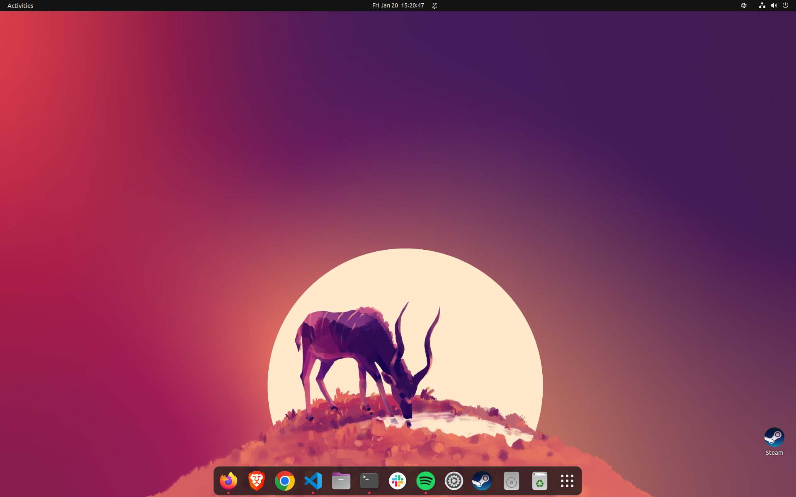

# my-ubuntu-setup

Setup ubuntu system for dev work and daily use quickly using ```setup.sh```.




## How to use

1. Download the [setup.sh](setup.sh) file.
2. Open the terminal and run the following command:

    ```bash
    chmod +x setup.sh
    ```
    This commands will make the file executable


    ```bash
    ./setup.sh USERNAME EMAIL
    ```

    This command will run the script and install all the packages. Replace USERNAME and EMAIL with your GitHub username and email.


